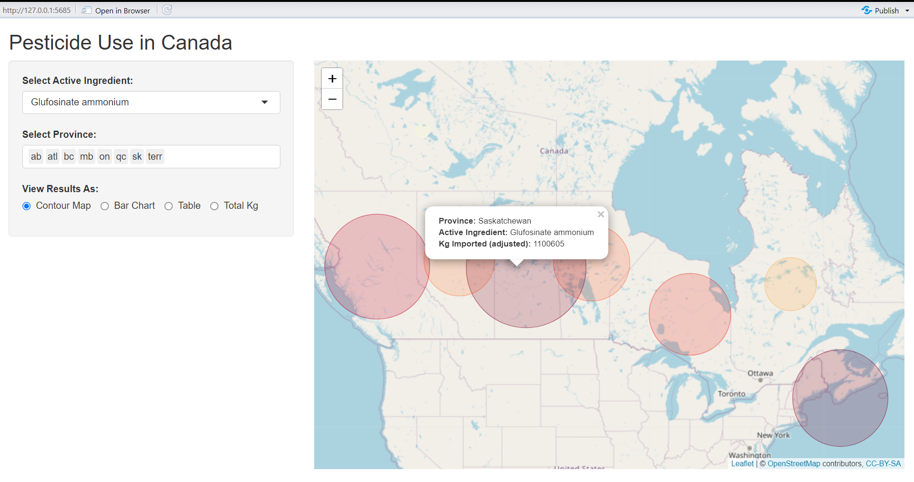

# Proprietary-Canadian-Pesticide-Use-Shiny-
A Shiny web application that visualizes pesticide usage data for 268 active ingredients across 8 provinces/regions, providing insights into the use of 268 active pesticide ingredients. The data includes geospatial coordinates and the amount of pesticide (in kilograms) imported into each region, adjusted using proprietary data processing methods.

# Pesticide Use Data Application

This Shiny web application visualizes pesticide usage data across 8 provinces/regions, providing insights into the use of 268 active pesticide ingredients. The data includes geospatial coordinates and the amount of pesticide (in kilograms) imported into each region, adjusted using proprietary data processing methods.

## Features
- **Active Ingredient Selection**: Allows users to filter the data by pesticide active ingredient.
- **Province Selection**: Users can choose multiple provinces/regions for focused analysis.
- **View Options**: Results can be displayed as:
  - A **leaflet map** showing the distribution of pesticide use with geographic markers.
  - A **bar chart** summarizing pesticide usage by region.
  - A **table** displaying total pesticide use per region.
  - A **total amount** of pesticide imported (adjusted) across selected regions.

## Data Overview
The data presented in this app covers pesticide usage across multiple regions in Canada. For each active ingredient, it provides:
- Total kilograms of pesticide imported (adjusted for region-specific multipliers).
- Geospatial information to visualize the distribution on a map.
- Aggregated data by region, which can be explored using charts or tables.

### Disclaimer
The data used in this application is proprietary and copyrighted by **Patrick Stephenson (2024)**. The methods used to process and adjust the data, including the calculation of pesticide imports and regional multipliers, are confidential. All rights to this data are reserved.

## Running the Application
You can run the Shiny application by clicking the 'Run App' button above. The application is built with R and requires the following libraries:
- `shiny`
- `leaflet`
- `ggplot2`
- `dplyr`
- `DT`

### Data Input
The input data file used in this application is `PMRA_Data_geocoded2.csv`, which contains geospatial coordinates (latitude, longitude) for each pesticide usage record along with corresponding data for active ingredient names, regions, and imported pesticide quantities.

## Application Usage
1. **Select Active Ingredient**: Choose the pesticide active ingredient from the dropdown to filter the data.
2. **Select Provinces**: Choose one or more provinces/regions for analysis. This selection will update all displayed results.
3. **View Results As**: Choose from one of the following options to view the data:
   - **Contour Map**: Visualize the data on an interactive map.
   - **Bar Chart**: See the total pesticide imports by region.
   - **Table**: Review the summarized totals for each region.
   - **Total Kg**: View the total adjusted kilograms of pesticide imported across the selected regions.

## Contact
For inquiries regarding the application or the data, please contact **Patrick Stephenson**. stepminer@gmail.com
https://ps-consults.com/

## License
The data is copyrighted and all rights are reserved by **Patrick Stephenson (2024)**.© 2024 Patrick Prézeau Stephenson
